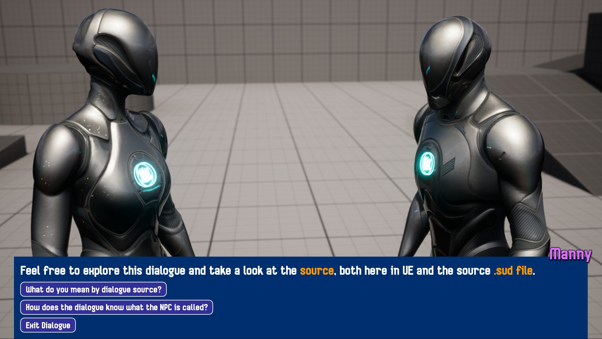

# SUDS Example Project

This is an example project for [Steve's Unreal Dialogue System (SUDS)](https://github.com/sinbad/SUDS).



You can find the Script for the dialogue in [Content/Dialogue/Dlg_FAQExample.sud](Content/Dialogue/Dlg_FAQExample.sud).
This is imported into Unreal Editor as an asset of the same name, and used as
a basis for the runtime dialogue.

There is a [VSCode Extension](https://github.com/sinbad/SUDS/blob/master/docs/vscode.md)
to make editing SUDS dialogue more pleasant. 

## FAQ

### 1. The SUDS or StevesUEHelpers libraries are missing

This is because you haven't cloned the submodule as well - some git clients do this automatically, some don't.
If yours didn't, run these commands in the root of the examples repository:

```
git submodule init
git submodule update
```

Then build again.